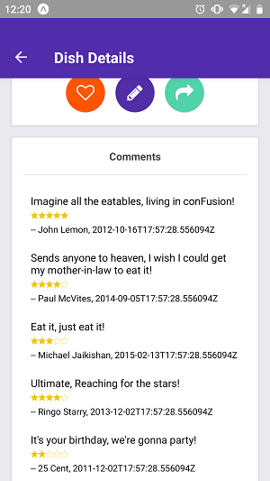
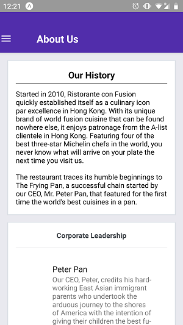

# Coursera-React-Native-Course-Confusion
This is a restaurant application built as a part of the react native course on coursera.

This is a restaurant mobile application which has some of typical features that you would find in a restaurant application.

1. You can view the menu for the restaurant.
2. You can rate the dishes.
3. You can comment on the dishes.
4. You can view the history of the restuarant.
5. You can make reservations.
6. You can share the dishes on various social media platforms.

Some of the screenshots from the application are:

